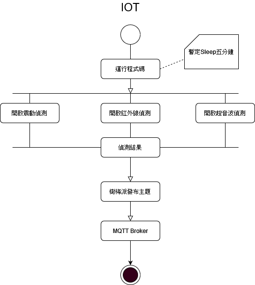
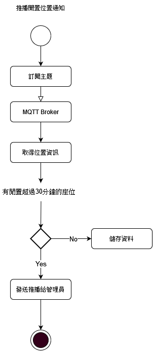

<!--
 * @Author: your name
 * @Date: 2022-04-01 14:53:07
 * @LastEditTime: 2022-04-01 17:01:59
 * @LastEditors: Please set LastEditors
 * @Description: 打开koroFileHeader查看配置 进行设置: https://github.com/OBKoro1/koro1FileHeader/wiki/%E9%85%8D%E7%BD%AE
 * @FilePath: \time-house-sensor\README.md
-->
# 時光屋座位感測

## 系統需求
1. Raspberry Pi 3 Model B *10
2. 紅外線感測器 *10
3. ID插卡機*10

## 實作方法
1. 利用Sensor偵測到時光屋座位的使用現況並透過MQTT協定傳送資料

 

2. 利用LINE BOT 通知管理員現在有閒置座位

## 進行方式
- 第一周
    - 設計Linebot的Wireframe
    - 架設Linebot（至少能主動推播一筆資料）
    - 建立資料庫
    - 建立假資料

- 第二周
    - Linebot建好功能選單
    - 樹梅派與Sensor接通
    - 撰寫Sensor資料處理的程式碼
    - 製作Line Bot 圖文選單

- 第三周
    - 虛擬機MQTT Broker
    - 架設後端的Server
- 第四周
    - 成果測試（於時光屋架設好設備）

## issue（假設插卡情況）
1. 使用完畢座位將物品攜帶（人不在｜卡不在｜東西不在）
2. 暫時離開座位上廁所（人不在｜卡不在｜東西在）
3. 外出處利事情將東西放置在座位但沒有使用（人不在｜卡不在｜東西在）
4. 在MonoSpace中但沒有坐在時光屋的座位（人不在｜卡在｜東西在）
5. 使用完畢座位但忘記將卡片帶離（人不在｜卡在｜東西不在）

## 預期達成目標
### 初階
1. 判斷此座位是否已超過半小時無人使用
2. 管理者能夠收到誰的座位已閒置超過30分鐘的通知以及查看目前座位使用狀況
3. Monospace會員能夠查看目前時光屋的座位使用情況
### 進階
1. 判斷此座位目前是誰在使用

